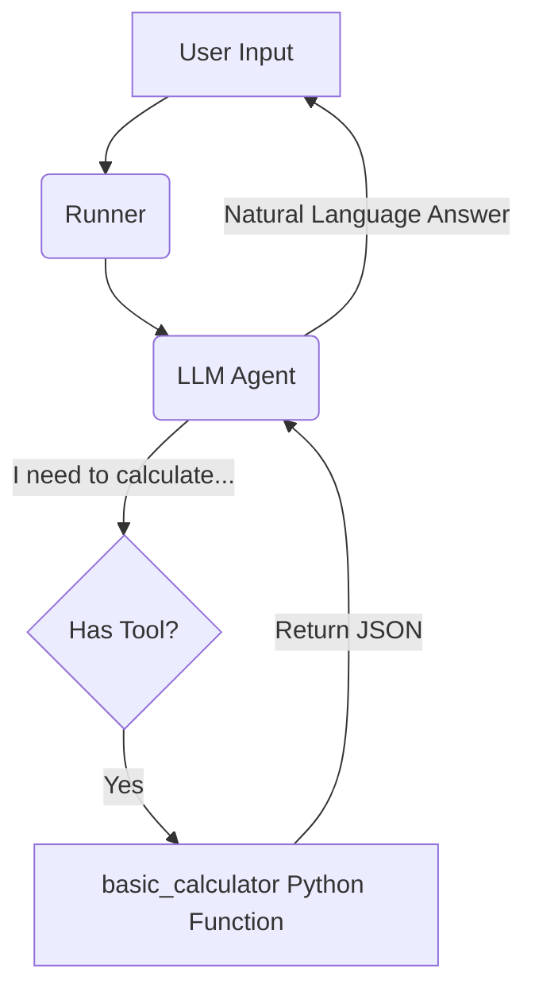

# Module: Agent Tool Use (Function Calling)

This project demonstrates the **Function Calling** capabilities of the Google ADK framework. It implements a strict "Math Assistant" that delegates all arithmetic operations to a deterministic, type-safe Python function instead of relying on the LLM's internal calculations.

## 🧠 Logic & Visualization

To understand how **Tools** work, let's use the **"The Accountant & The Calculator" Analogy**:

  * **Agent (The Accountant):** Intelligent, understands language, intent, and context. However, strictly forbidden from doing "mental math" to avoid errors (hallucinations).
  * **Tool (The Calculator):** A dumb but perfectly accurate device. It takes numbers, performs an operation, and returns a result. It has no "intelligence," just logic.
  * **Runner (The Desk):** The environment where the Accountant passes inputs to the Calculator and reads the display.

### Data Flow Diagram

The diagram below shows the "Loop": The Agent pauses generation to execute code, then resumes with the result.



## 📂 Project Structure

The project follows a Clean Architecture ensuring business logic is separated from Agent logic.

```text
.
├── Makefile             # Automation: install, lint, run
├── pyproject.toml       # Dependencies (google-adk, pydantic)
├── src
│   └── basic_calculator
│       ├── agent.py     # AGENT: Binds LLM + Tools
│       ├── config.py    # CONFIG: Env vars & Settings
│       └── tools
│           └── math_tools.py # LOGIC: Pure Python implementation
└── tests                # Unit Tests
```

## ⚙️ Setup & Installation

1.  **Prerequisites**: Python 3.13+, Poetry installed.
2.  **Environment**:
    Use the `Makefile` to install dependencies:
    ```bash
    make install
    ```
3.  **Configuration**:
    Create a `.env` file in the root directory. Note the double underscore for nested settings:
    ```ini
    GOOGLE__API_KEY=your_actual_api_key
    ```

## 🚀 Usage

The project includes an interactive CLI simulation in `src/basic_calculator/agent.py`.

Run the agent:

```bash
make run
```

### Expected Output

Notice the `[SYSTEM: Tool call Detected]` log. This confirms the LLM did **not** guess the number; it actually executed your Python code.

```text
--- STARTING AGENT (gemini-2.5-flash-lite) ---
Type 'exit' to quit.

USER: Multiply 15.5 by 4 and then tell me the result.
AGENT:
[SYSTEM: Tool call Detected: basic_calculator]
The result of multiplying 15.5 by 4 is 62.0.
```

## 💻 Code Highlights

### 1\. Type-Safe Logic (Pydantic)

We use Pydantic to enforce strict types *before* the code even runs. This prevents "Garbage In, Garbage Out".

```python
class CalculatorInput(BaseModel):
    a: float
    b: float
    operation: OperationType # Enum: ADD, SUBTRACT...
```

### 2\. The Tool Binding

We wrap the pure Python function into an ADK `FunctionTool`. The Agent's instruction forces it to use this tool.

```python
calc_tool = FunctionTool(basic_calculator)

root_agent = LlmAgent(
    name="MathAssistant",
    # ...
    instruction="You must use the 'basic_calculator' tool for ANY calculation.",
    tools=[calc_tool] # <--- Giving the "Accountant" his "Calculator"
)
```
